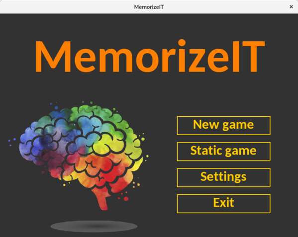
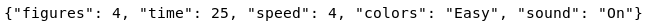
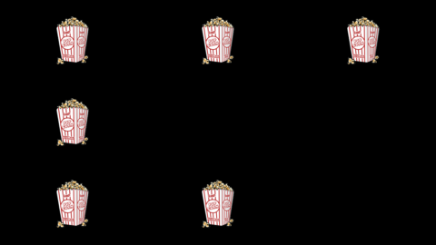
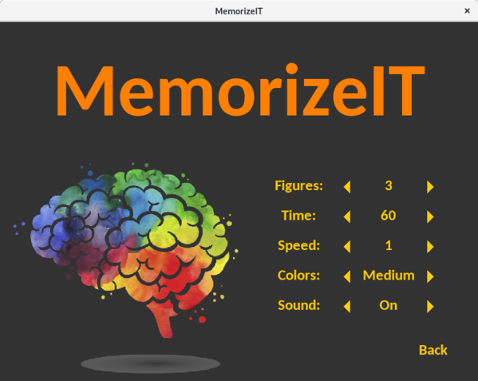
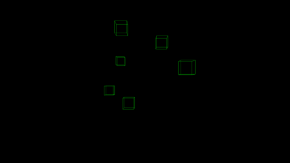
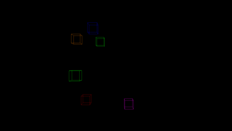
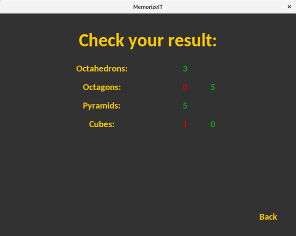

# MemorizeIT

Project is created to **increase memory and focus** among children or adults who would like to take part in training. 
Rules of game are quite simple. You just need to count elements displayed on screen and remember their type. At the end 
you will be asked to write down your results and confront them with exact ones. This will be verified by marking your 
answer with proper color (correct - green, not - red). Difficulty of game can be increased by adding more types of 
elements to count, mixing their colors, turning sound off or changing time dedicated to each wave. It is also more 
difficult to play normal game mode (instead of static), because figures are moving which is additional distraction. *I 
wish you enjoyable experience with game and best results in memory training. Good luck!*

### Beware: 
Application was developed and tested on **Fedora**. Some functions may not work or behave in different way on other 
systems. Few adjustments were made for **Windows** too (if any problems with game speed in normal mode will occur 
please adjust method `get_speed` in *game.py* module to your personal needs).

### Before using make sure that:
1. **Python3** is installed on your system (application was developed on version **3.6**)
2. All additional **libraries** are included:
    - collections
	- json
	- pathlib
	- PIL
	- pygame
	- pyopengl
	- pyopengl accelerate
	- random
	- sys
	- time
3. Necessary **modules** are in game directory:
	- colors.py
	- config.py
    - figure.py
	- game.py
	- gui.py
	- main.py

### How to run application:
1. Linux:
    - download project
    - open its directory in *terminal*
    - use command: `chmod +x main.py`
    - write: `./main.py`
2. Windows:
    - Launch:
        - download project
        - open *main.py* in *IDLE*
        - click *Run Module* under *Run* menu
    - Build:
        - download project
        - open its directory in *cmd*
        - make sure [*PyInstaller*](https://pyinstaller.readthedocs.io/en/stable/installation.html) is in your system
        - use command: `pyinstaller --windowed --onefile main.py`
        - move *images* directory and *sound.ogg* to newly created *exe* file
        

### How to configure game:
- settings are stored in game directory - *settings.txt* file
	
	- making changes in application settings menu updates this file
	- removing it will restore default game settings
- default images (displayed in static mode) are stored in game directory - *images/elements/*
	- they can be removed (figures will be displayed instead)
	- or replaced (application scales images automatically - user do not need to worry about it)
	
- sound of new elements appearing in game is stored in application directory - *sound.ogg*
	- it can be replaced by any sound in ogg format (just make sure it won't be too long to avoid unpleasant experience)
- game can be configured in applications settings menu, it contains options like:

	- figures - number of unique types of the elements which may appear during game
	- time - duration of game in seconds
	- speed - level of speed difficulty from slowest to fastest
	- colors - level of color difficulty (not used with images in static mode)
		- Easy - each type of elements displayed in same color
		
		- Medium - each wave of elements displayed in various color
		- Hard - every element displayed in various color
		
	- sound - specifies if sound should be used with every new wave of elements
- **spoiler alert**: for hidden game mod take a look at `class Figure3D` and `class Wave3D` in *figure.py* module

### How to play game:
- adjust game settings
- pick mode: normal (new) or static game
- count elements of each type separately
- write down and submit your result
- compare it with exact values
- change game difficulty and make progress

### Making change in code:
- anybody is welcome to make a change in code to adjust it to personal needs
- code documentation generated with pydoc3 is included in application directory - *docs/*
	- modules contain docstring
	- it has numpydoc format
	- if you prefer:
		- other type of documentation over pydoc3 feel free to generate it
		- work on uncommented version of code - check commit before adding documentation

##### Author: Adrian Niec
##### This project under the MIT License - see the LICENSE file for details
